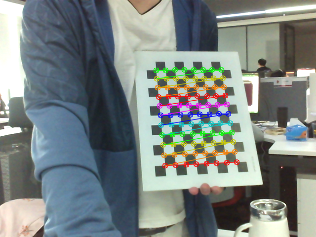
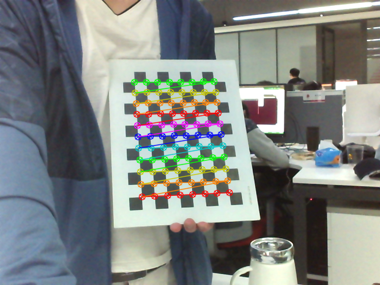
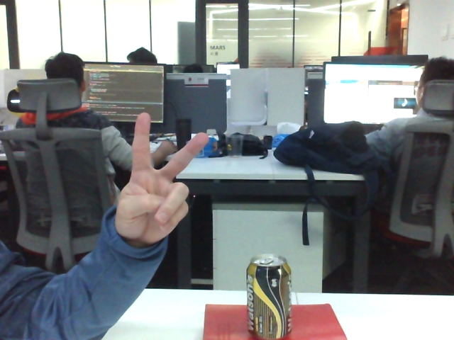
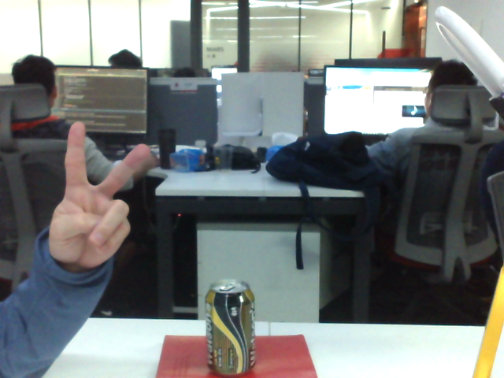
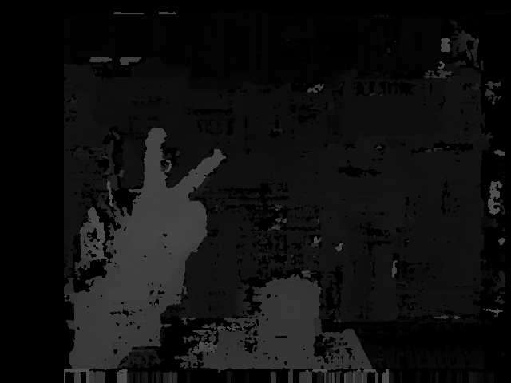
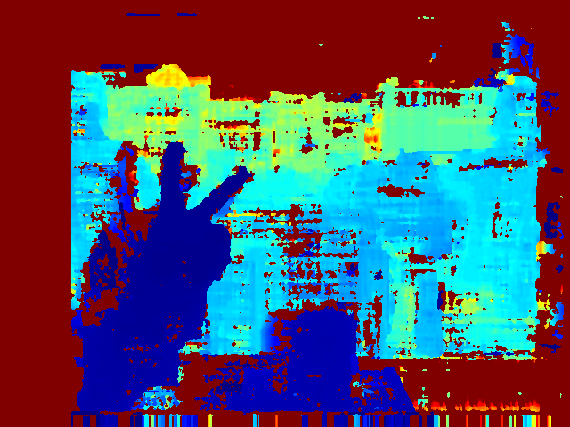
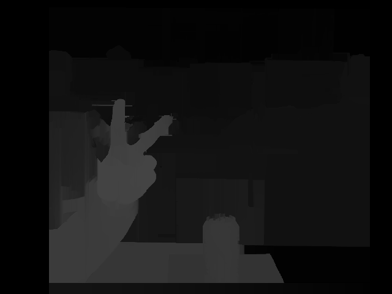
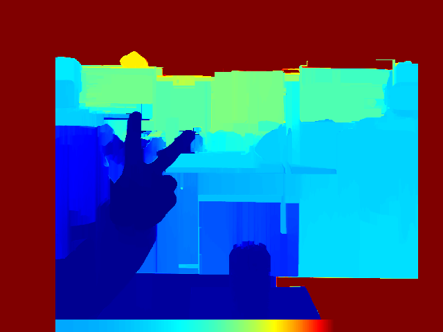
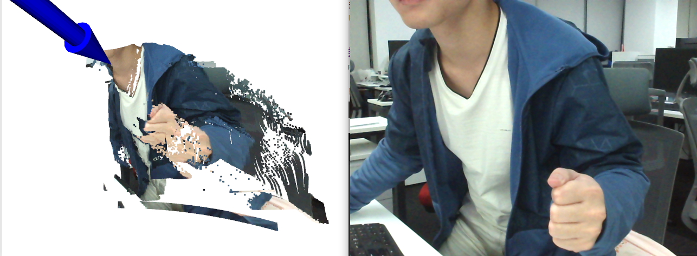

# Camera-Calibration-Reconstruct

"Этот проект реализует stereo calibration, stereo rectification (включая distortion removal), stereo matching, disparity calculation и depth calculation/3D coordinate computation."

- [x] Supports dual USB-connected stereo cameras
- [x] Supports single USB-connected stereo cameras (left and right cameras are displayed in a single video)
- [x] Supports monocular camera calibration::[mono_camera_calibration.py](mono_camera_calibration.py)
- [x] Supports stereo camera calibration:[stereo_camera_calibration.py](stereo_camera_calibration.py)
- [x] Supports WLS filtering for disparity maps
- [x] Supports stereo distance measurement (click on the image to obtain depth distance)
- [x] Supports Open3D and PCL point cloud display

## 1. Directory Structure

```
.
├── config       # Файлы параметров камеры
├── core         # Основные алгоритмы камеры
├── data         # Собранные данные камеры
├── demo         # Демонстрационные файлы
├── libs         # Сторонние зависимости
├── scripts       # Скрипты
│   ├── mono_camera_calibration.sh     # Скрипт калибровки монокулярной камеры
│   └── stereo_camera_calibration.sh   # Скрипт калибровки стереокамеры
├── get_stereo_images.py                  # Захват изображений для калибровки
├── mono_camera_calibration.py            # Калибровка монокулярной камеры
├── stereo_camera_calibration.py          # Калибровка стереокамеры
├── requirements.txt                      # Зависимости
└── README.md

```

# 2. Environment

- Dependencies can be found in [requirements.txt](requirements.txt)
- python-pcl (安装python-pcl需要一丢丢耐心，是在不行，就用open3d吧)
- open3d-python=0.7.0.0
- opencv-python
- opencv-contrib-python

## 3. Stereo Camera Calibration and Rectification

#### (1) Capture left and right images of the calibration board

```bash
bash scripts/get_stereo_images.sh
```

- Before capturing data, adjust the camera focus to ensure the calibration board is clearly visible.
- When capturing chessboard images, the calibration board should occupy approximately 1/2 to 1/3 of the view.
- It is recommended to set detect=True for real-time chessboard detection.
- Press s or c on the keyboard to save left and right images.

|left_image                        |right_image                           |
|:--------------------------------:|:------------------------------------:|
||   |

#### (2) [Monocular Camera Calibration](scripts/mono_camera_calibration.sh)

- `bash scripts/mono_camera_calibration.sh`
- If the error exceeds 0.1, recalibrate the camera.

```bash
#!/usr/bin/env bash

image_dir=data/lenacv-camera # Chessboard images  
save_dir=configs/lenacv-camera # Save calibration results   
width=8
height=11
square_size=20 #mm
image_format=png # Image format (e.g., png, jpg) 
show=True # Show detection results
# left camera calibration
python mono_camera_calibration.py \
    --image_dir  $image_dir \
    --image_format $image_format  \
    --square_size $square_size  \
    --width $width  \
    --height $height  \
    --prefix left  \
    --save_dir $save_dir \
    --show $show

# right camera calibration
python mono_camera_calibration.py \
    --image_dir  $image_dir \
    --image_format  $image_format  \
    --square_size $square_size  \
    --width $width  \
    --height $height  \
    --prefix right  \
    --save_dir $save_dir \
    --show $show
```
After execution, `left_cam.yml` and `right_cam.yml` parameter files for the left and right cameras will be generated in `$save_dir`.


#### (3) [Stereo Camera Calibration](scripts/stereo_camera_calibration.sh)
- `bash scripts/stereo_camera_calibration.sh`
- If the error exceeds 0.1, recalibrate the camera.

```bash
image_dir=data/lenacv-camera # Chessboard images  
save_dir=configs/lenacv-camera # Save calibration results  
width=8  
height=11  
square_size=20 # mm  
image_format=png # Image format (e.g., png, jpg)  
show=False # Show detection results  

# Stereo camera calibration  
python stereo_camera_calibration.py \
    --left_file $save_dir/left_cam.yml \
    --right_file $save_dir/right_cam.yml \
    --left_prefix left \
    --right_prefix right \
    --width $width \
    --height $height \
    --left_dir $image_dir \
    --right_dir $image_dir \
    --image_format  $image_format  \
    --square_size $square_size \
    --save_dir $save_dir 

```
After execution, the `stereo_cam.yml` camera parameter file will be generated in `$save_dir`.


## 4.Disparity and Depth Maps

- Run the demo to compute the disparity map and recover depth information.

|    param    | type | Description                                       |
|:-----------:|:----:|:--------------------------------------------------|
| stereo_file | str  | Stereo camera configuration file, e.g., "configs/lenacv-camera/stereo_cam.yml" |
| left_video  | str  | Left camera ID or video file                                      |
| right_video | str  | Right camera ID or video file                                      |
|  left_file  | str  | Left test image file                                          |
| right_file  | str  | Right test image file                                      |
|   filter    | bool | Whether to filter the disparity map                                      |

```bash
python demo.py  \
  --stereo_file "configs/lenacv-camera/stereo_cam.yml" \
  --left_video "data/lenacv-video/left_video.avi" \
  --right_video "data/lenacv-video/right_video.avi" \
  --filter True
```
- Example output:

|      Left View                                       |              Right View              |
|:-------------------------------------------------:|:------------------------------------:|
|                       |         |
|      **Disparity map (unfiltered)**                           |             **Depth map (unfiltered)**             |
|                  |         |
|      **Disparity map (after filtering)**                             |             **Depth map (after filtering)**             |
|           |  |

- Rendering

 

## 5.Stereo Distance Measurement

- After running `demo.py`, clicking anywhere on the image prints the corresponding depth distance in the termina
- Clicking on a hand region prints an estimated distance of about 633 mm (0.63 meters), which is quite accurate.
```
(x,y)=(203,273),depth=633.881653mm
(x,y)=(197,329),depth=640.386047mm
(x,y)=(222,292),depth=631.549072mm
(x,y)=(237,270),depth=630.389221mm
(x,y)=(208,246),depth=652.560669mm
```

## 6.3D Point Cloud

- 3D point cloud visualization using Open3D.
- You can rotate the coordinate system and zoom in on the point cloud with a mouse.

  
  
## 7.References

- https://github.com/aliyasineser/stereoDepth
- <Stereo Matching for Real-World Scenes - Depth Map Explanation> : https://www.cnblogs.com/riddick/p/8486223.html
- <Stereo Distance Measurement Theory and Python Implementation> : https://blog.csdn.net/dulingwen/article/details/98071584


